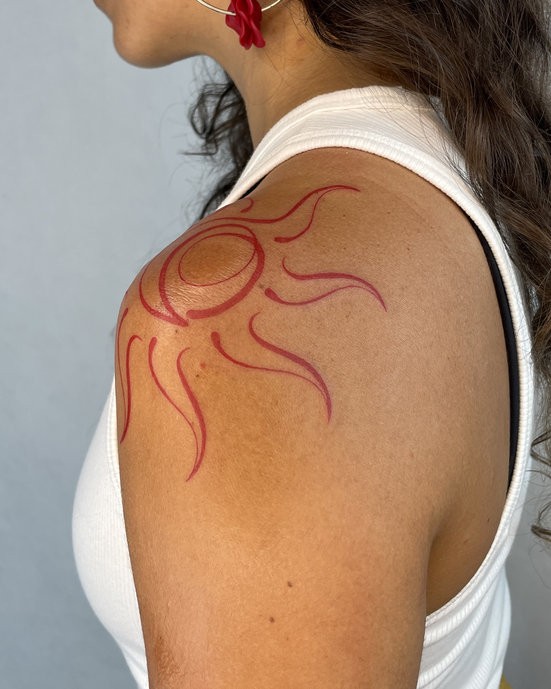

# Tanta Tinta — website

Your site is plain HTML/CSS/JS — no build step, no server required to preview it.
Double-click `index.html` to open it in a browser right now.

## 1. Adding your photos

Drop your images into these folders, using these exact file names (or edit the
matching HTML file to reference whatever names you use):

| Page | Folder | Files expected |
|---|---|---|
| Home — hero photo | `images/hero/` | `hero-photo.jpg` (top-right of the homepage) |
| Home — 6 category tiles | `images/home/` | `tattoos.jpg`, `shop.jpg`, `murals.jpg`, `workshops.jpg`, `collabs.jpg`, `about.jpg` |
| Tattoos | `images/tattoos/` | `tattoo-01.jpg` … `tattoo-09.jpg` |
| Wall Murals | `images/murals/` | `mural-01.jpg` … `mural-06.jpg` |
| Workshops | `images/workshops/` | `workshop-01.jpg` … `workshop-06.jpg` |
| About Me | `images/about/` | `portrait.jpg` |
| Shop | `images/shop/` | whatever you set in `image:` per product, see below |

**Hero photo:** just drop a file named `hero-photo.jpg` into `images/hero/` — the
homepage automatically shows it in place of the placeholder box. No HTML edit
needed; if the file isn't there yet, a placeholder box shows instead.

**Homepage category tiles ("Explore the studio"):** each of the 6 tiles
(Tattoos, Shop, Wall Murals, Workshops, Collabs, About Me) already has a photo
slot with a dark overlay so the title stays readable. Add matching files to
`images/home/` (`tattoos.jpg`, `shop.jpg`, etc.) and they'll appear automatically
— no HTML edit needed. To change *which* file a tile uses, open `index.html`,
find the tile (search for `dest-card`), and edit the `background-image:url('...')`
part of its `style` attribute.

For the gallery pages (Tattoos / Murals / Workshops), each placeholder box in the
HTML currently looks like this:

```html
<div class="media-item" data-reveal><div class="media-placeholder">...tattoo-01.jpg</div></div>
```

Replace the inner `<div class="media-placeholder">...</div>` with:

```html
<div class="media-item" data-reveal></img></div>
```

Do this once per photo. Add more `<div class="media-item">` blocks (copy an existing
one) if you have more than 6–9 photos for a page — the grid expands automatically.

For your About Me portrait, replace the placeholder block inside `about.html` the
same way, pointing at `images/about/portrait.jpg`.

## 2. Editing the shop (products, prices, stock)

Open **`js/products.js`**. That one file is your whole catalog — copy a block to
add a new piece, delete a block to remove one, or just change the `price` /
`stock` numbers. Categories must be exactly `silkscreen`, `prints` or `jewels`
to match the shop's filter tabs. Save the file and refresh the page.

**On-the-go editor:** open your live site at `shop.html?admin=1` and you'll see a
"Manage the shop" panel to add/edit pieces visually. This saves changes to that
browser only — press **Export products.js** and paste the downloaded file over
`js/products.js` to make the change visible to everyone.

## 3. Cart & checkout — what works today, and what to connect

The cart, quantities and checkout summary are fully working (stored locally in
the visitor's browser). For actually collecting payment, `checkout.html` gives
two paths:

- **Order via WhatsApp** — works right now. The visitor's order and total land in
  a WhatsApp message to you, and you send them your Chilean or Brazilian bank
  details to complete payment by transfer.
- **Pay by card** — currently a "coming soon" button. Static sites can't take
  card payments directly (for security, card processing has to run on a server,
  not in the visitor's browser). The free option that supports both Chile and
  Brazil is **Mercado Pago Checkout Pro**: no monthly fee, you only pay a small
  percentage per sale, and it pays out to both CLP and BRL accounts.
  To switch it on:
  1. Create a Mercado Pago account (Chile or Brazil) and get your Access Token.
  2. Deploy one small free serverless function (e.g. on Vercel or Netlify) that
     creates a "payment preference" from the cart and returns Mercado Pago's
     checkout URL — this keeps your Access Token off the public website.
  3. Point the "Pay by card" button at that function instead of being disabled.
  A developer can do this in an afternoon; I'm happy to write that function with
  you when you're ready.

## 4. Contact details to update

Search each HTML file for these and replace with your real details:
- WhatsApp number: `5521995780587` (used in `data-whatsapp-number` attributes and footer links)
- Email: `contacto.tantatina@gmail.com`
- Instagram: already linked to `instagram.com/tantatinta_`

## 5. Putting it online

Any static host works. Easiest free options:
- **Netlify** — drag the whole `tantatinta` folder onto app.netlify.com/drop.
- **GitHub Pages** — push this folder to a GitHub repo and enable Pages in settings.
Both give you a free URL in minutes, and you can connect your own domain later.

## 6. Design notes

- Colors, fonts and spacing all live at the top of `css/style.css` — change the
  `:root` values there to update the whole site at once.
- Palette: ink black, bone paper, brick red accent, olive and tan — a warm,
  gallery-like palette in keeping with your linework, built to complement (not
  copy pixel-for-pixel) your Adobe Portfolio site.
